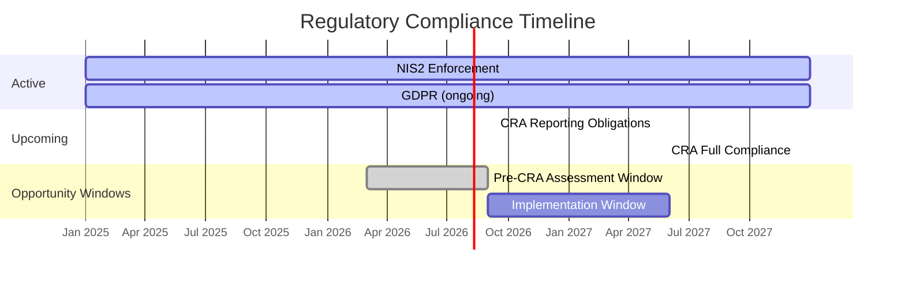
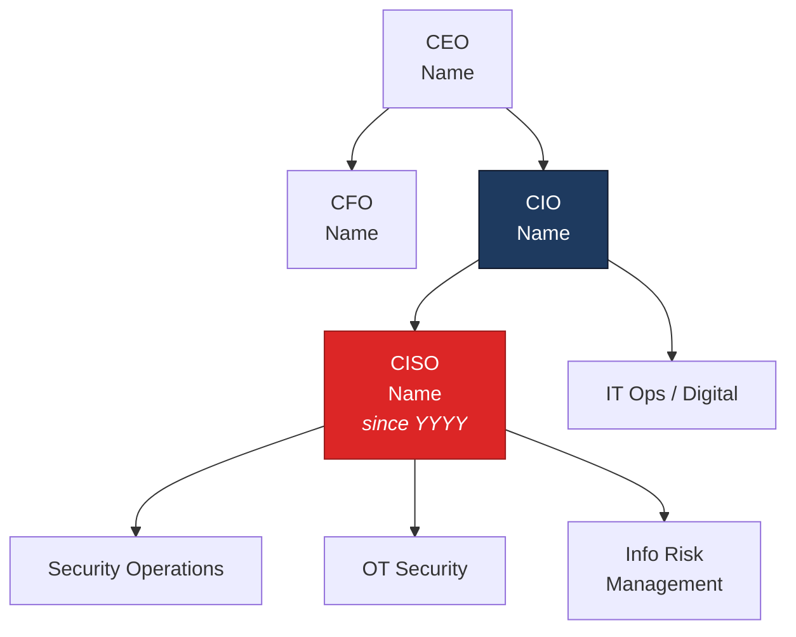
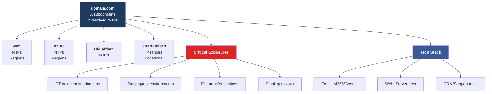

# Strategic Account Targeting Report Template

Use this structure for the strategic targeting report. Every section is required unless marked optional.

---

## Document Header

```
# [Company Name] - Strategic Account Targeting Report

**Classification:** Confidential - Sales Enablement
**Document Type:** Executive Account Strategy
**Version:** 1.0
**Created:** [Date]
**Research Approach:** Agentic CTI + Financial + Business Profiler + EASM/OSINT

---
```

## Executive Summary

Use dashboard-style HTML for the account classification and key metrics:

```html
<div class="score-section">
  <p class="score-title">Account Classification</p>
  <p class="score-value">[STRATEGIC PARTNER / KEY ACCOUNT / TARGET ACCOUNT]</p>
  <p class="score-subtitle">[One-line justification]</p>
</div>

<div class="dashboard-row">
  <div class="metric-card">
    <p class="metric-value">[CRITICAL/HIGH/MEDIUM]</p>
    <p class="metric-label">Risk Assessment</p>
  </div>
  <div class="metric-card">
    <p class="metric-value">[Currency][X]M — [Y]M</p>
    <p class="metric-label">3-Year Revenue Opportunity</p>
  </div>
  <div class="metric-card">
    <p class="metric-value">[IMMEDIATE/HIGH/MEDIUM]</p>
    <p class="metric-label">Urgency</p>
  </div>
</div>
```

2-3 paragraph summary of why this is a strategic opportunity. Lead with the convergence of financial capacity, threat severity, and regulatory pressure.

### The Perfect Storm

| Factor | Status | Implication |
|--------|--------|-------------|
| **Financial Capacity** | [Revenue/Profit] | [Budget implication] |
| **Threat Level** | [Risk level + key finding] | [Security need] |
| **Regulatory Deadline** | [Key regulation + date] | [Compliance driver] |
| **Buyer Intent** | [HIGH/MEDIUM/LOW] | [Sales signal] |
| **Access Path** | [Connection type] | [Engagement approach] |

---

## PART I: THE OPPORTUNITY

### 1.1 Financial Intelligence

Use metric cards for headline financial figures, then a table for full detail:

```html
<div class="dashboard-row">
  <div class="metric-card">
    <p class="metric-value">[Revenue]</p>
    <p class="metric-label">Annual Revenue</p>
  </div>
  <div class="metric-card">
    <p class="metric-value">[IT Spend]</p>
    <p class="metric-label">IT Spend (Est.)</p>
  </div>
  <div class="metric-card">
    <p class="metric-value">[Security Budget]</p>
    <p class="metric-label">Security Budget (Est.)</p>
  </div>
</div>
```

Full financial detail table:
| Metric | Value | Source |
|--------|-------|--------|
| Annual Revenue | | |
| Net Profit | | |
| Employees | | |
| IT Spend (est.) | | |
| Security Budget (est.) | | |
| Growth Score | | |

Analysis of budget capacity and investment signals.

### 1.2 Market Position

Strategic importance in industry. Competitive landscape. Why this company is a high-value target for both threat actors AND security vendors.

---

## PART II: THE PAIN

### 2.1 Security Incident History

Timeline of confirmed incidents with date, type, actor (if attributed), impact, and source.

Pattern analysis table:

| Incident Pattern | Weakness Indicated | Service Opportunity |
|-----------------|-------------------|-------------------|
| [Pattern] | [Root cause] | [Your service] |

### 2.2 Attack Surface Analysis

Infrastructure overview table:

| Category | Count/Details | Risk Level |
|----------|--------------|------------|
| Subdomains | | |
| Cloud Providers | | |
| Email Security | | |
| SSL/TLS Issues | | |
| Exposed Services | | |

Critical exposures with specific examples and the service that addresses each.

### 2.3 Threat Actor Targeting

Threat actor table:

| Actor | Attribution | Sector Match | Activity Level | Relevance |
|-------|------------|-------------|---------------|-----------|
| | | | | |

Key insight on active targeting and what it means for the prospect.

---

## PART III: THE DEADLINE

### 3.1 Regulatory Pressure Landscape

Applicable regulations with dates, penalties, and specific requirements:

| Regulation | Deadline | Status | Penalty | Required Actions |
|-----------|----------|--------|---------|-----------------|
| | | | | |

### 3.2 Timeline Urgency Matrix

Use a Mermaid Gantt chart to visualize regulatory deadlines and urgency windows:



Populate with actual deadlines from regulatory_analyzer output. Mark overdue/imminent items as `crit`.

Message to prospect about urgency: why acting now saves money vs. last-minute compliance.

---

## PART IV: THE APPROACH

### 4.1 Key Stakeholders

Executive contacts table:

| Name | Title | Tenure | Background | Access Path |
|------|-------|--------|------------|-------------|
| | | | | |

Security leadership team. Specialized contacts (OT, compliance, risk).
Mutual connections and warm introduction paths.

### 4.2 Value Proposition Framework

Tailored opening message for each key contact persona (CISO, CIO, compliance officer).
Key talking points per persona linking their specific pain to your solution.

### 4.3 Service Opportunity Matrix

| Service | Pain Point Addressed | Estimated Value | Timeline | Priority |
|---------|---------------------|----------------|----------|----------|
| | | | | |

Total opportunity calculation:
- **Year 1:** Initial assessments + quick wins
- **Year 2:** Implementation + expansion
- **Year 3:** Managed services + ongoing

---

## PART V: THE CAMPAIGN

### 5.1 Engagement Sequence

Week-by-week action plan:

| Week | Action | Channel | Owner | Objective |
|------|--------|---------|-------|-----------|
| 1 | | | | |
| 2-3 | | | | |
| 4-6 | | | | |

### 5.2 Competitive Positioning

| Competitor | Their Pitch | Our Counter |
|-----------|------------|-------------|
| | | |

Key differentiators specific to this account.

### 5.3 Risk Factors & Mitigations

| Risk | Probability | Impact | Mitigation |
|------|------------|--------|------------|
| | | | |

---

## PART VI: ACTION PLAN

### Immediate Actions (Next 7 Days)

Numbered action items with owner and deadline.

### Q1/Q2 Milestones

| Milestone | Target Date | Success Criteria |
|-----------|------------|-----------------|
| | | |

### Revenue Target

| Quarter | Service | Expected Revenue |
|---------|---------|-----------------|
| | | |

---

## APPENDICES

### Appendix A: Intelligence Sources

| Source | Type | Contribution |
|--------|------|-------------|
| | | |

### Appendix B: Key Dates

Timeline of all relevant events (incidents, regulatory deadlines, contract renewals, leadership changes).

### Appendix C: Organization Chart (Estimated)

Use a Mermaid diagram for the org chart. Example:



Populate with actual discovered contacts. Highlight the primary target (CISO) in red and secondary targets in blue.

### Appendix D: Attack Surface Summary

Use a Mermaid diagram for the attack surface overview. Example:



Populate with actual recon data. Use red for critical exposures, blue for infrastructure.

---

## Document Control

| Field | Value |
|-------|-------|
| **Document ID** | [Company]-STR-[Year]-001 |
| **Classification** | Confidential - Sales Enablement |
| **Owner** | [Lead name] |
| **Review Cycle** | Weekly during active pursuit |

---

*Made with love by an AI agent · a skill developed by [PEACH STUDIO](http://peachstudio.be)*
